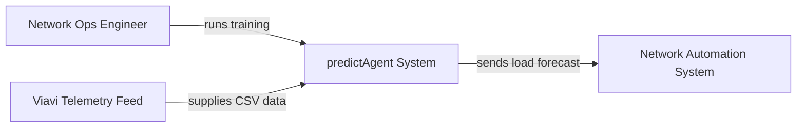
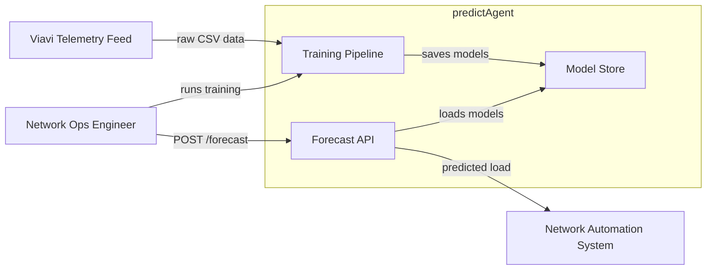

# predictAgent — Overview

An autonomous entity whose primary purpose is forecasting specific numerical values, such as network demand or cell load. In a typical agentic lifecycle (Observe → Reason → Act), the load prediction algorithm serves as a core component of the Perception or Reasoning layers.

## What It Does

predictAgent reads historical telemetry from cell sectors and learns each sector's load pattern. Given a recent window of readings, it predicts the fraction of downlink capacity that will be in use 15 minutes from now. This prediction supports proactive decisions — such as pre-empting congestion before it affects users.

## C4 Level 1 — System Context

*predictAgent reads raw cell telemetry, learns each sector's load pattern, and delivers a 15-minute-ahead forecast to downstream automation.*

## C4 Level 2 — Container

*The Training Pipeline processes telemetry and saves one model per cell sector; the Forecast API loads those models on demand and returns predictions.*

## What Goes In

Training requires a CSV file of Viavi cell telemetry. Inference requires a cell sector name and at least 48 consecutive 15-minute readings containing downlink and uplink resource counts, connection count, downlink throughput, and site power.

## What Comes Out

Each forecast response contains the cell name, a `predicted_prb_util_dl` value (a float from 0 to 1 representing predicted downlink capacity utilisation), and the model version that produced it.

## Where It Fits

predictAgent operates in the Reasoning layer of an agentic system. A downstream automation agent receives the forecast and can act — for example, by pre-allocating capacity or rerouting traffic — before congestion occurs, closing the Observe → Reason → Act loop.
