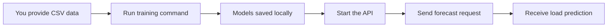

# predictAgent — User Guide

## How It Works

*Training happens once per cell; after that, the running API answers forecast requests instantly from saved models.*

## Before You Start

- Viavi telemetry CSV available at `viavi-dataset/raw/CellReports.csv`
- predictagent installed (see installation guide)

## Workflow 1: Train the Models

1. Place your Viavi CSV at `viavi-dataset/raw/CellReports.csv`
2. Confirm the target site in `config/default.yaml` under `data.site_filter` (default: `S1/`)
3. Run: `predictagent-train`
4. Watch the console — one line per trained cell sector with error scores
5. Models appear in `models/`, one subfolder per cell sector

## Workflow 2: Get a Forecast

1. Start the server: `predictagent-serve`
2. Confirm it is running: open `http://localhost:8000/health` — expect `{"status":"ok",...}`
3. Send a `POST` to `http://localhost:8000/forecast` with JSON containing:
   - `cell_name` — e.g. `"S1/B2/C1"`
   - `rows` — at least 48 consecutive 15-minute readings, each with DL/UL resource counts, connection count, throughput, and site power
4. The response field `predicted_prb_util_dl` is the forecast — a number from 0 to 1

## Common Issues

| Symptom | Fix |
|---|---|
| `422` error from `/forecast` | Request has fewer than 48 rows — add more recent readings |
| `404` error from `/forecast` | No trained model for that cell name — run `predictagent-train` first |
| Training: "No rows remain after filtering" | `data.site_filter` in `config/default.yaml` doesn't match any cell names in your CSV |
| Training: "Raw data file not found" | CSV not at the path set in `data.raw_path` in `config/default.yaml` |
| Server starts but `/health` unreachable | Port 8000 in use — change `api.port` in `config/default.yaml` |
